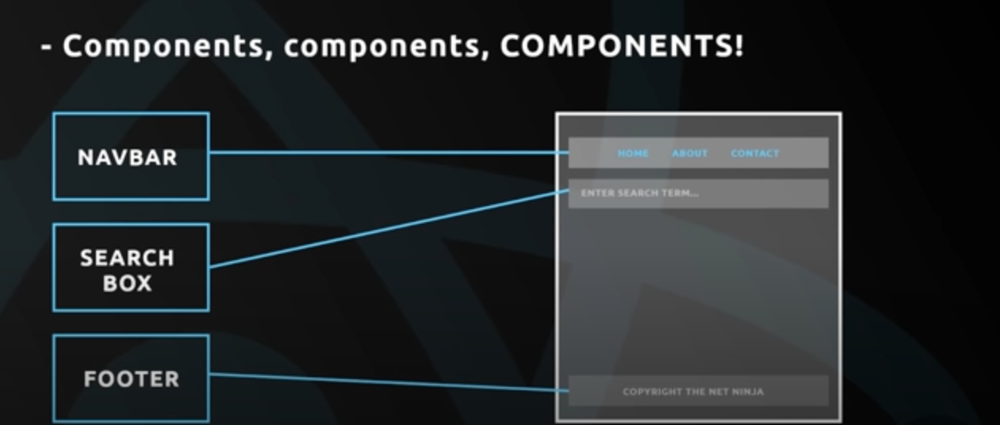

# react-redux-complete-playlist
The course files for the React &amp; Redux Complete tutorial playlist on The Net Ninja YouTube channel.

# Lesson 1
## What is React?
- JavaScript library created by Facebook
- Also used by Netflix and Instagram
- Used to create JS-driven dynamic web apps.
- In that regard, can be compared to Angular and Vue.

## What is Redux?
- A layer on-top of React
- Helps with state management of our app
    - data in the app
    - UI state in the app

## What we will learn (hopefully)
- React Basics
    - components, events, templates, props and forms
- React Router
    - routes, route parameters, redirects
- Redux
    - Stores, actions and reducers

# Lesson 2
## Components
The lifeblood of React is components.

  </img> 

## Virtual DOM

The Virtual DOM makes React fast...

  </img> 

